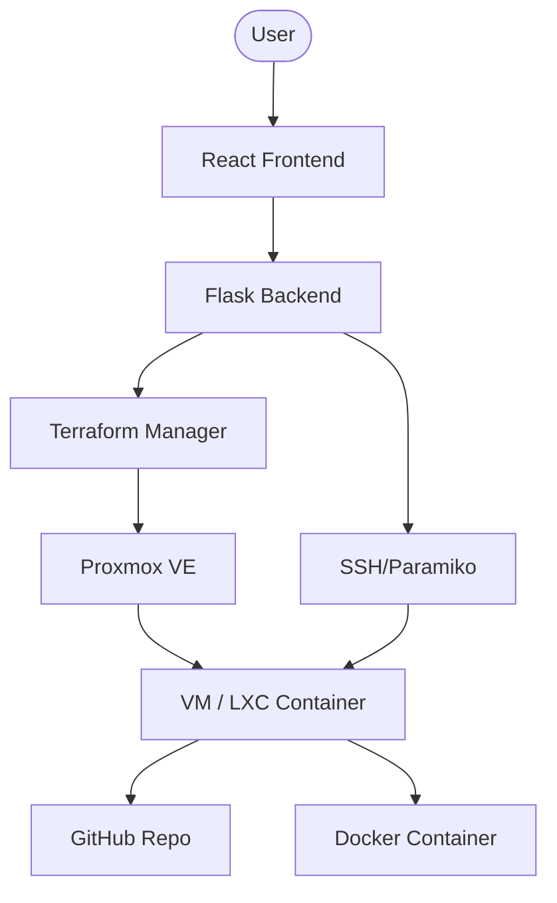

# NimbusLab: DIY PaaS on Proxmox

NimbusLab is a lightweight Platform-as-a-Service (PaaS) that enables developers to deploy applications directly from GitHub to Virtual Machines (VMs) or Linux Containers (LXCs) running on a Proxmox VE host. 

Built with **React**, **Python (Flask)**, and **Terraform**, NimbusLab automates the entire infrastructure provisioning and application deployment workflow.

## 🚀 Features

- **One-Click Deployment**: Deploy directly from any public GitHub repository.
- **Infrastucture Choice**: Choose between LXC containers (for speed) or full VMs (for isolation).
- **Automated Provisioning**: Uses Terraform to spin up infrastructure on Proxmox.
- **Dynamic Dockerization**: Automatically generates Dockerfiles based on the selected framework.
- **Real-time Logs**: Stream deployment logs directly to the browser.
- **Theming**: Sleek Dark/Light mode design.

## 🏗️ Architecture

1.  **Frontend**: A modern dashboard where users input their GitHub repo and choose infrastructure specs.
2.  **Backend**: Orchestrates the deployment by triggering Terraform and managing SSH scripts.
3.  **Infrastructure**: Terraform provisions the requested resources on Proxmox.
4.  **Deployment**: Shell scripts are uploaded via SFTP and executed to install dependencies, clone the repo, and run the app inside Docker.

## 🛠️ Supported Frameworks

- **React** (Vite/CRA)
- **Node.js**
- **Django**
- **Flask**

## ⚠️ Identified Issues & Roadmap

During the project analysis, the following areas were identified for improvement:

### Critical Fixes
- [ ] **Security**: Remove hardcoded credentials from `main.py` and Terraform files. Move to environment variables (`.env`).
- [ ] **SSH Security**: Switch from password-based SSH to SSH Key authentication.
- [ ] **Hardcoding**: Parameterize Proxmox Node and IP addresses.

### Technical Debt
- [ ] **Port Management**: Implement a persistent port registry (currently in-memory only).
- [ ] **Docker Flexiblity**: Allow custom Dockerfiles or detection of custom start scripts.
- [ ] **Cleanup**: Add functionality to stop and destroy deployments from the UI.
- [ ] **Error Handling**: Improve script execution logging to provide more granular failure causes.

## 🔧 Prerequisites

- **Proxmox VE Server**: Running and accessible via API.
- **Terraform**: Installed on the backend host.
- **Proxmox Provider**: `Telmate/proxmox` configured.
- **Cloud-Init Images**: Ubuntu cloud-init image present in Proxmox.

---

*This project was analyzed and documented as part of a DevOps/PaaS research initiative.*
